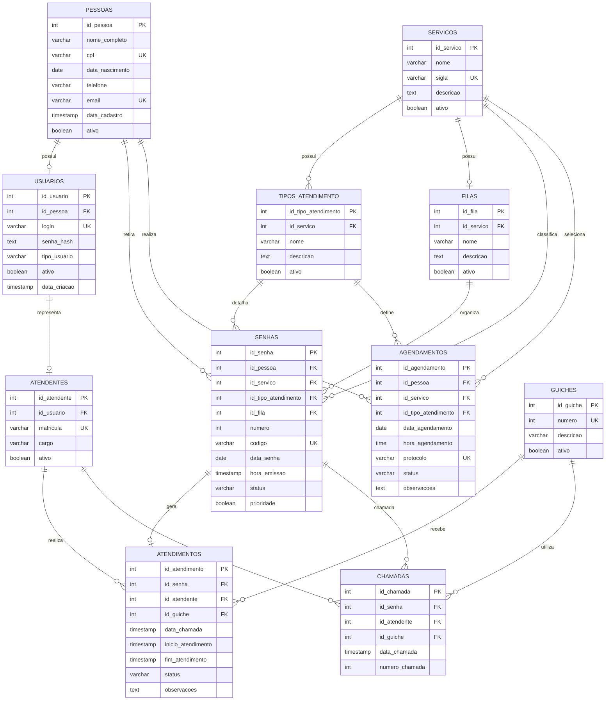

# Diagrama Entidade-Relacionamento

O modelo abaixo representa o banco do ATENDE PVH.



## Relacionamentos principais

### Pessoa → Usuário
Uma pessoa pode possuir uma conta de acesso. A relação é 1:0..1.

### Usuário → Atendente
Um usuário pode representar um atendente. A relação é 1:0..1.

### Serviço → Tipo de atendimento
Um serviço possui vários tipos de atendimento.

Exemplo:

```text
Nota Fiscal de Serviço
├── Emissão/consulta de NFS-e
├── Cancelamento de nota fiscal
├── Correção de nota fiscal
└── Dúvidas sobre NFS-e
```

### Pessoa → Senha
Um cidadão pode retirar várias senhas ao longo do tempo.

### Senha → Atendimento
Uma senha pode originar um atendimento.

### Atendente → Atendimento
Um atendente realiza vários atendimentos.

### Guichê → Atendimento
Um guichê recebe vários atendimentos ao longo do dia.

### Senha → Chamadas
Uma senha pode ser chamada mais de uma vez, permitindo registrar o histórico de chamadas.
